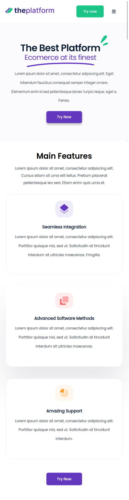
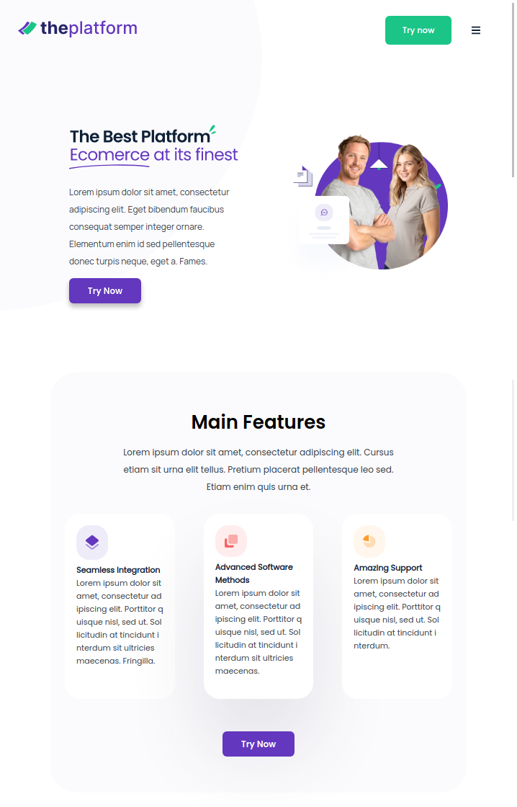

## React - Landing Page
-------------------------------

### How to run the project

- Unzip the folder.
- run `npm install`.
- run `npm start`.

<hr/>

### Used packages 
- fontawsome 
- react-fontawesome
- node-sass
- react-responsive
- uuid
- material-ui/core

<hr/>

### Folder structure

```
      assets 
            |
            └─── fonts
            |
            └─── images
    components
            |
            └─── containers
            |            |
            |            └─── App
            |
            └─── UI
                |
                └─── MainBanner
                |
                └─── MainBannerContent
                |
                └─── MainBannerImg
                |
                └─── FeatureCard
                |
                └─── FeaturesSection
                |
                └─── MoreButton
                |
                └─── Navbar
      styles 
            |
            └─── fonts
            |
            └─── mixins  
            |
            └─── variables           

```
<hr/>

### Landing Page View


<br/>

<br/>

